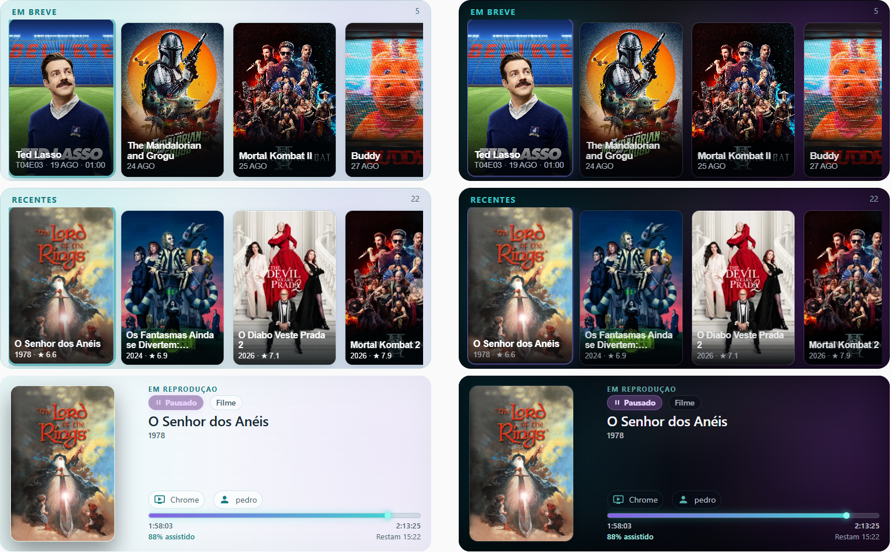
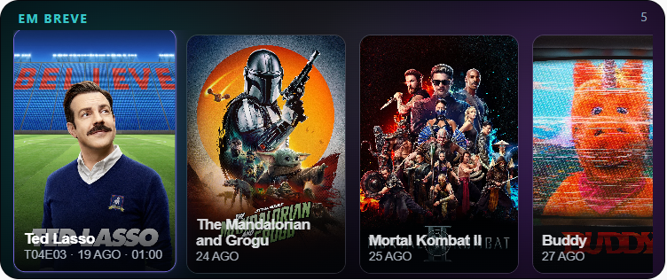
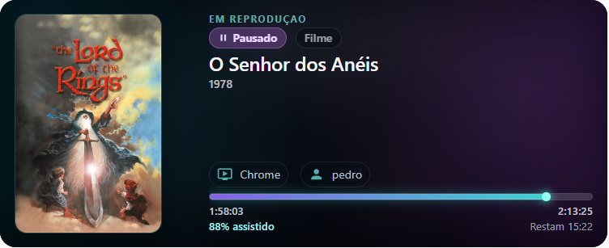

<p align="center">
  
</p>

The **Made in Brazil** and **Built with Vibe Coding** badges are community-facing project notes, not certifications or endorsements.

<h1 align="center">🐙 Octopus Media</h1>

<p align="center">A cinematic media integration and card for Home Assistant, built around Jellyfin, Radarr and Sonarr.</p>

<p align="center">
  <a href="https://www.home-assistant.io/"></a>
  <a href="https://hacs.xyz/"></a>
  <a href="LICENSE"></a>
  
  
  <a href="https://github.com/Kraken-Labz/octopus-media-card/actions/workflows/ci.yml"></a>
</p>

Octopus Media began as a personal homelab project. It was created first for its author's own setup and is now shared with the community because it may be useful to other Home Assistant users. It is not a commercial product and has no official affiliation with Home Assistant, Jellyfin, Radarr, or Sonarr.

The project is openly developed with **Vibe Coding / AI-assisted development**. AI was used intensively as an implementation partner for coding, debugging, testing, and refactoring. Product direction, architecture, UX, visual language, test criteria, scenarios, and final approval remained human-directed.



## Integration and card

These are two related but distinct product parts:

- **Octopus Media** is the Home Assistant integration. It owns the ConfigEntry,
  provider connections, polling, normalization, snapshots, and secure image delivery.
- **Octopus Media Card** is the Lovelace frontend card supplied by the integration.
  It consumes snapshots and never receives provider credentials or private service URLs.

The integration domain is `octopus_media`; the custom card type is
`custom:octopus-media-card`.

## Features

### Recently added

Shows recent movies and episodes from Jellyfin, with poster artwork, titles, and available metadata.


### Upcoming

Combines upcoming movies from Radarr and episodes from Sonarr. Movies show their title and date/time when available; episodes show the series title with `TxxExx · date · time` metadata.



### Now Playing

Shows the current Jellyfin playback session, including title, episode context, device, user, progress, and timing. The card is read-only and does not provide playback controls.



### Light and Dark

Use `auto`, `dark`, or `light` appearance. The interface changes theme tokens while posters and other artwork preserve their original colors.


### Auto-scroll

Recent and Upcoming can advance one item at a time with a continuous loop. Auto-scroll pauses on hover, focus, and touch interaction, and respects reduced-motion preferences. Playing does not auto-scroll.

### Other details

- Shared poster-strip geometry for Recent and Upcoming.
- Playing Hero with truthful playing, paused, empty, unavailable, and stale states.
- English and Brazilian Portuguese interface translations.
- Secure, opaque image references and authenticated image delivery.
- Visual configuration editor with real previews and explicit recovery for removed ConfigEntries.
- Local Octopus Media branding assets.

## Installation with HACS

1. Open **HACS → Integrations**.
2. Search for **Octopus Media**. Until the repository is included in the default HACS
   catalog, add `https://github.com/Kraken-Labz/octopus-media-card` as a custom repository
   with category **Integration**.
3. Install the integration and restart Home Assistant if HACS requests it.
4. Go to **Settings → Devices & services → Add integration** and select **Octopus Media**.
5. Select an existing Jellyfin ConfigEntry. Jellyfin is required; Radarr and Sonarr are
   optional sources.

The card bundle is provided by the integration at:

```text
/octopus_media/octopus-media-card.js
```

If the resource is not registered automatically by the current Home Assistant setup,
add that URL under **Settings → Dashboards → Resources** as a JavaScript module.
Manual installation is intended for development and fallback scenarios, not as the
primary public path.

## Configuration

Configure the integration through its Home Assistant UI flow. Do not put provider URLs,
credentials, API keys, Jellyfin user IDs, or TLS settings in card YAML.

The integration setup uses:

- **Name** — the public name of this ConfigEntry.
- **Jellyfin** — required; select an existing Home Assistant Jellyfin ConfigEntry.
- **Radarr** — optional; select an existing ConfigEntry when available.
- **Sonarr** — optional; select an existing ConfigEntry when available.

Octopus Media reuses those existing Home Assistant entries. It does not ask for a second
Jellyfin password, Radarr API key, or Sonarr API key. Use **Settings → Devices & services
→ Octopus Media → Configure** to reconfigure the same entry without changing its ID.

### Add the card

Use the visual card editor and select the Octopus Media ConfigEntry. A new card defaults
to Recent, automatic appearance, the supported item count, and disabled auto-scroll.
The editor exposes only settings that apply to the selected mode:

- Integration
- Content / mode: Recent, Upcoming, or Playing
- Appearance: Auto, Dark, or Light
- Item count for Recent and Upcoming
- Auto-scroll and its interval for Recent and Upcoming

The equivalent minimal YAML is:

```yaml
type: custom:octopus-media-card
entry_id: YOUR_OCTOPUS_MEDIA_ENTRY_ID
mode: recent
layout: auto
appearance: auto
```

See [the configuration reference](docs/configuration.md) for supported legacy fields,
layout behavior, and responsive constraints.

## Modes

### Recent

Shows recently added Jellyfin movies and episodes. Episodes can be grouped by series
according to the integration options.

### Upcoming

Shows future Radarr movies and Sonarr episodes. Movies show title and date/time when
available. Episodes show the series title and `TxxExx · date · time` metadata. Missing
optional providers produce an empty or partial Upcoming state without preventing Jellyfin
from loading.

### Playing

Shows the current Jellyfin session state, including title, episode context, device, user,
progress, and timing when available. The card is read-only and does not provide playback
controls.

## Appearance and auto-scroll

`appearance: auto` follows the Home Assistant theme when possible; `dark` and `light`
select the corresponding Octopus surface tokens. Artwork keeps its original colors in
all appearance modes.

For Recent and Upcoming, enable auto-scroll with:

```yaml
auto_scroll: true
auto_scroll_interval: 6
```

Auto-scroll advances one item at a time, loops continuously, pauses while the card is
hovered, focused, or being touched, and is disabled when all items fit or reduced motion
is requested. Playing does not auto-scroll.

## Reconfigure and removed ConfigEntries

Use **Settings → Devices & services → Octopus Media → Configure** to change an existing
entry without creating a second one. Reconfigure preserves the entry ID.

If a card's referenced ConfigEntry is removed, the card shows a dedicated configuration
not-found state. Edit the card and explicitly select the replacement entry. The card never
silently reassigns an existing configuration by matching its title.

## Troubleshooting

- If Octopus Media is missing from **Add integration**, restart Home Assistant and clear
  the browser cache after installing the custom integration.
- Confirm that the selected Jellyfin ConfigEntry is loaded and reachable.
- Radarr and Sonarr are optional; check their integration entries and calendars when
  Upcoming is empty or partial.
- If a card reports that its configuration is not found, edit it and select a current
  Octopus Media entry explicitly.
- For reproducible bugs, include Home Assistant version, Octopus Media version, selected
  mode, and sanitized logs. Never include credentials, tokens, private URLs, or raw dumps.

## Support

Report bugs and feature requests in the
[GitHub issue tracker](https://github.com/Kraken-Labz/octopus-media-card/issues).

## Status

The first public version is planned as **v0.1.0**. It is not considered published until
the first GitHub Release is created.

## Development

The backend lives under `custom_components/octopus_media/`; frontend source is under
`frontend/src/`. Repository CI runs Ruff, mypy, pytest, TypeScript checks, Vitest,
the frontend build, bundle verification, HACS validation, and Hassfest.

```text
python -m pip install -r requirements-dev.txt
ruff check .
ruff format --check .
mypy custom_components tests
python -m pytest
pnpm --dir frontend install
pnpm --dir frontend lint
pnpm --dir frontend test
pnpm --dir frontend build
pnpm --dir frontend verify:bundle
```

## License

MIT
