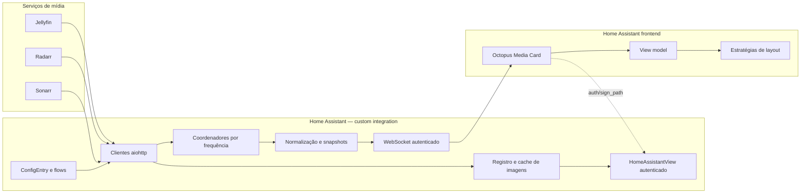

# Octopus Media Card — Arquitetura

Status: arquitetura aprovada para o MVP; Fases 3A e 3B Jellyfin implementadas em 21/07/2026.

Status atual do código local: `recent`, `playing`, imagens e `upcoming` estão implementados,
incluindo providers/coordinator de Radarr/Sonarr, normalização, estados parciais/stale e referências
de imagem seguras. Esta baseline ainda não foi implantada no HA-LAB nem publicada/released.

> O código local atual fornece `recent`, `playing`, imagens e `upcoming`, incluindo providers e
> coordinator de Radarr/Sonarr, normalização, estados parciais/stale e referências de imagem seguras.
> Esta baseline ainda não foi implantada no HA-LAB nem publicada/released.

## 1. Identidade e objetivo

O Octopus Media Card é um projeto híbrido mínimo para Home Assistant, mantido em um único repositório:

- produto: **Octopus Media Card**;
- repositório: `octopus-media-card`;
- domínio da custom integration: `octopus_media`;
- tipo Lovelace: `custom:octopus-media-card`;
- distribuição: uma custom integration pelo HACS, contendo também o bundle do card.

O produto exibe exclusivamente pôsteres e metadados de três categorias:

1. `recent`: filmes e episódios recentemente incorporados ao Jellyfin;
2. `upcoming`: filmes do calendário do Radarr e episódios do calendário do Sonarr;
3. `playing`: sessões Jellyfin reproduzindo ou pausadas;
4. `carousel`: configuração de seções; na implementação atual, a primeira seção configurada é
   renderizada e a alternância completa entre múltiplas seções permanece pendente.

A integração existe somente para guardar credenciais, consultar os três serviços, normalizar dados, compartilhar polling, entregar imagens autenticadas e expor o contrato ao card. O navegador não acessa Jellyfin, Radarr ou Sonarr diretamente.

## 2. Fora do escopo

O MVP não inclui:

- qBittorrent, Bazarr ou TMDB;
- pipeline de mídia, saúde de containers ou infraestrutura;
- filas de download, torrents ou estado de legendas;
- biblioteca completa, recomendações ou pesquisa global;
- entidades de infraestrutura, dezenas de sensores, automações ou notificações;
- controles play, pause, seek, mute ou stop;
- comandos remotos;
- dashboard operacional completo;
- chamadas diretas do card às APIs externas;
- credenciais, cookies ou URLs autenticadas no YAML do card;
- uma segunda instalação HACS para o frontend.

Qualquer proposta que introduza um item desta lista exige uma decisão de escopo separada.

## 3. Visão do sistema



Princípios:

- uma `ConfigEntry` representa uma stack de mídia;
- todos os serviços são opcionais, mas pelo menos um deve ser configurado;
- Jellyfin fornece as capacidades `recent` e `playing`;
- Radarr e/ou Sonarr fornecem `upcoming`;
- vários cards usando a mesma entrada compartilham clientes, coordenadores e caches;
- falhas são isoladas por serviço e não eliminam dados válidos das outras fontes;
- modos de dados e layouts visuais são independentes.

## 4. Limite de segurança

### 4.1 Dados que permanecem no backend

Devem permanecer exclusivamente em `ConfigEntry.data` ou na memória da integração:

- URLs dos serviços;
- API keys;
- Jellyfin user ID;
- cookies eventualmente usados pelos clientes;
- parâmetros de autenticação;
- descritores internos de imagens;
- segredo usado para gerar referências opacas.

O card recebe somente `entry_id`, capabilities, snapshots normalizados, referências opacas e caminhos do próprio Home Assistant assinados por tempo curto.

### 4.2 Autorização

- todos os comandos WebSocket exigem conexão Home Assistant autenticada;
- todos os endpoints HTTP exigem autenticação Home Assistant;
- o endpoint de imagem também valida `entry_id`, referência registrada e variante permitida;
- o backend nunca aceita URL, host, caminho de arquivo ou identificador externo fornecido pelo card;
- o MVP permite leitura a usuários autenticados do Home Assistant, pois não há um modelo público de permissões por ConfigEntry; esta política deve ser destacada na documentação de segurança;
- `refresh` é autenticado e limitado por usuário e por ConfigEntry;
- não existem comandos de controle de reprodução.

### 4.3 Logs e diagnósticos

- nenhuma exceção deve interpolar chave, senha, cookie, cabeçalho ou URL assinada;
- URLs e endereços internos serão redigidos nos diagnósticos;
- IDs internos e o segredo de referências serão redigidos;
- diagnósticos podem informar versões, capabilities, opções não sensíveis, disponibilidade, idade dos dados e códigos de erro fechados.
- `ConfigEntry.data` nunca é serializada, nem mesmo para posterior redaction;
- o payload permitido é agregado e explícito: versão/schema, nome da instância, capabilities, estado e código fechado por serviço, intervalos, preferências não sensíveis, revisão, contagens e flags `stale`/`partial`;
- IDs de servidor, usuário, item, sessão e dispositivo, aliases, URLs, caminhos, headers, chaves e o segredo de referências não pertencem ao contrato de diagnostics.

## 5. ConfigEntry, config flow e options flow

### 5.1 ConfigEntry

Uma entrada armazena uma instalação lógica. O config flow começa pela seleção dos serviços e exige pelo menos um.

O nome visível é persistido como `options.instance_name` e espelhado em `ConfigEntry.title` somente pelas APIs públicas do Home Assistant. Ele é solicitado na criação, editável no options flow e preservado por reautenticação. Entradas `1.0`–`1.2` migram para o schema `1.3`, usando o título legado ou, se vazio, `Octopus Media Card`; a migração não altera `entry_id`, `unique_id`, credenciais nem o segredo de referências.

Dados sensíveis:

| Serviço  | Campos                                               |
| -------- | ---------------------------------------------------- |
| Jellyfin | URL, API key, usuário/user ID, `verify_ssl`, timeout |
| Radarr   | URL, API key, `verify_ssl`, timeout                  |
| Sonarr   | URL, API key, `verify_ssl`, timeout                  |

O flow deve:

- normalizar URLs sem registrar seus valores;
- validar esquema e host;
- testar conectividade e autenticação antes de salvar;
- rejeitar uma combinação de endpoints que duplique uma stack existente;
- permitir pular qualquer serviço opcional;
- oferecer reautenticação por serviço sem apagar credenciais válidas dos demais;
- distinguir `cannot_connect`, `invalid_auth`, `invalid_url`, `unsupported_version`, `timeout` e `unknown`;
- preservar o segredo interno usado para referências durante reautenticação e reconfiguração.

### 5.2 Capabilities

As capabilities são derivadas, nunca configuradas manualmente:

```json
{
  "recent": true,
  "upcoming": true,
  "playing": true
}
```

Regras:

- Jellyfin configurado: `recent=true` e `playing=true`;
- Radarr ou Sonarr configurado: `upcoming=true`;
- `carousel` não é capability; atualmente renderiza a primeira seção configurada. A alternância
  completa entre múltiplas seções permanece pendente.

`octopus_media/get_entries` retorna somente:

```json
{
  "entries": [
    {
      "entry_id": "01ABCDEF123456",
      "title": "Mídia da casa",
      "capabilities": {
        "recent": true,
        "upcoming": true,
        "playing": true
      }
    }
  ]
}
```

O editor oculta modos incompatíveis. Quando houver uma única entrada, poderá selecioná-la automaticamente.

### 5.3 Options flow

Preferências não sensíveis:

| Opção             |    Padrão |        Limite inicial |
| ----------------- | --------: | --------------------: |
| Sessões Jellyfin  |      10 s |                5–60 s |
| Recentes Jellyfin |     180 s |            60–1.800 s |
| Calendários       |     600 s |           300–3.600 s |
| Itens recentes    |        12 |                  1–50 |
| Itens futuros     |        12 |                  1–50 |
| Janela futura     |   90 dias |            1–365 dias |
| Agrupar episódios |    ligado |              booleano |
| Política Radarr   | `digital` |          enum fechado |
| Idioma            |    `auto` | `auto`, `pt-BR`, `en` |
| Formato de data   |    `auto` |          enum fechado |
| Aliases Jellyfin  |     vazio | mapa DeviceId → alias |

Altura, tema, densidade e quantidade visível pertencem ao card, não à integração.

## 6. Clientes de API

Serão implementados clientes assíncronos isolados:

- `JellyfinClient`;
- `RadarrClient`;
- `SonarrClient`.

Todos usam a sessão `aiohttp` fornecida pelo Home Assistant, `async/await`, timeout explícito, cancelamento correto e exceções próprias. GETs idempotentes podem fazer retry curto com backoff exponencial e jitter; erros de autenticação não são repetidos automaticamente.

Antes de implementar cada cliente é obrigatório:

1. confirmar documentação oficial ou comportamento real da versão suportada;
2. registrar em `docs/api-endpoints.md` cada endpoint, método, campo usado e versão;
3. criar fixture fictícia e sanitizada;
4. escrever testes sem rede real;
5. não implementar endpoint presumido.

Nenhum cliente síncrono ou sessão HTTP paralela será criado sem justificativa documentada.

## 7. Coordenação, falha parcial e stale

### 7.1 Coordenadores

| Coordenador                  | Fonte             | Frequência padrão |
| ---------------------------- | ----------------- | ----------------: |
| `JellyfinRecentCoordinator`  | Jellyfin recentes |             180 s |
| `JellyfinPlayingCoordinator` | Jellyfin sessões  |              10 s |
| `UpcomingCoordinator`        | Radarr e Sonarr   |             600 s |

Cada `ConfigEntry` possui uma única instância de cada coordenador aplicável. Cards apenas assinam seus resultados; eles não iniciam polling.

### 7.2 Falha parcial

- Jellyfin offline não apaga o último calendário válido;
- Radarr offline não apaga itens válidos do Sonarr;
- Sonarr offline não apaga itens válidos do Radarr;
- falha de imagem não invalida o item;
- uma resposta inválida afeta somente a fonte correspondente;
- o último resultado válido pode ser preservado com `stale=true`;
- ausência real de itens após atualização válida produz lista vazia com `stale=false`;
- erro sem cache anterior produz seção vazia, disponibilidade offline e código de erro seguro.

O coordenador composto de upcoming mantém estado e digest separados por fonte para que uma falha não substitua a outra.

### 7.3 Deduplicação de eventos

Cada seção possui revisão e digest semântico. Campos puramente voláteis, como horário da tentativa de polling, não provocam transmissão por si só. Uma assinatura envia:

1. snapshot inicial completo;
2. patches contendo somente disponibilidade e seções semanticamente alteradas;
3. nenhuma mensagem quando o digest for idêntico.

`playing` normalmente muda a cada polling por posição/estado. `recent` e `upcoming` não são retransmitidos junto com cada avanço de reprodução.

## 8. Datas e política Radarr

Todas as datas do contrato são strings ISO 8601 conscientes de fuso, normalizadas para UTC e terminadas em `Z`.

O snapshot inclui:

```json
{
  "time_zone": "America/Sao_Paulo"
}
```

O backend calcula ordenação, `days_remaining` e classificação básica. O frontend traduz `today`, `tomorrow`, `future` e `overdue` usando o fuso do Home Assistant, nunca o fuso arbitrário do navegador.

Políticas Radarr:

- `digital`: data digital, padrão;
- `physical`: lançamento físico;
- `cinema`: estreia em cinema;
- `earliest`: primeira data futura disponível dentre os campos oficiais suportados.

Fallback: quando o campo da política escolhida não existir, usar a primeira data futura válida entre as outras datas oficiais. Se não houver data selecionável dentro da janela, o item não entra em upcoming. Os nomes exatos dos campos somente serão fixados após validação da API em `docs/api-endpoints.md`.

## 9. Contrato normalizado

### 9.1 Snapshot inicial

```json
{
  "schema_version": 1,
  "entry_id": "01ABCDEF123456",
  "revision": 42,
  "updated_at": "2026-07-21T02:00:00Z",
  "time_zone": "America/Sao_Paulo",
  "availability": {
    "jellyfin": {
      "state": "online",
      "last_success_at": "2026-07-21T02:00:00Z",
      "error": null
    },
    "radarr": {
      "state": "offline",
      "last_success_at": "2026-07-21T01:50:00Z",
      "error": "timeout"
    },
    "sonarr": {
      "state": "not_configured",
      "last_success_at": null,
      "error": null
    }
  },
  "recent": {
    "revision": 7,
    "updated_at": "2026-07-21T01:59:00Z",
    "stale": false,
    "partial": false,
    "items": [
      {
        "ref": "media_q7D2fL",
        "type": "movie",
        "title": "Título",
        "subtitle": null,
        "year": 2026,
        "season": null,
        "episode": null,
        "episode_count": 1,
        "added_at": "2026-07-21T00:30:00Z",
        "rating": 8.1,
        "poster_ref": "image_B6dK9x",
        "still_ref": null,
        "backdrop_ref": "image_G2pQ4n"
      }
    ]
  },
  "upcoming": {
    "revision": 11,
    "updated_at": "2026-07-21T01:50:00Z",
    "stale": true,
    "partial": true,
    "items": [
      {
        "ref": "media_L4rM8c",
        "source": "radarr",
        "type": "movie",
        "title": "Título",
        "subtitle": "Filme · 2026",
        "release_at": "2026-07-23T00:00:00Z",
        "monitored": true,
        "downloaded": false,
        "status": "announced",
        "relative_day": "future",
        "days_remaining": 2,
        "poster_ref": "image_P9vT3a"
      }
    ]
  },
  "playing": {
    "revision": 105,
    "updated_at": "2026-07-21T02:00:00Z",
    "stale": false,
    "partial": false,
    "items": [
      {
        "ref": "session_N8kR5s",
        "device_name": "Jellyfin Web",
        "device_alias": "TV da Sala",
        "user_name": "Usuário",
        "state": "playing",
        "type": "episode",
        "title": "Nome da série",
        "subtitle": "T02E04 · Nome do episódio",
        "genres": ["Drama", "Aventura"],
        "rating": 8.7,
        "video_resolution": "4K",
        "video_hdr": true,
        "audio_channels": "5.1",
        "position_seconds": 100,
        "duration_seconds": 1000,
        "progress": 10,
        "poster_ref": "image_T5mC7q",
        "still_ref": "image_S8nR2w",
        "backdrop_ref": null,
        "updated_at": "2026-07-21T02:00:00Z"
      }
    ]
  }
}
```

Regras:

- `ref`, `session_ref` conceitual e referências de imagem são opacas;
- campos ausentes são `null`, nunca strings vazias;
- `state`: `online`, `offline` ou `not_configured`;
- erros fechados: `auth_failed`, `timeout`, `unreachable`, `unsupported_version`, `invalid_response`, `unknown`;
- `stale` significa que itens exibidos vieram do último ciclo válido;
- `partial` significa que uma das fontes aplicáveis falhou;
- `schema_version` muda em alterações incompatíveis;
- nenhum objeto bruto de API atravessa a fronteira.

### 9.2 Snapshots leves e detalhes sob demanda

O snapshot continua leve e não abre chamadas por item. Em `playing`, existe uma exceção limitada:
no máximo dois `genres`, `rating`, `video_resolution`, `video_hdr` e `audio_channels` podem
acompanhar a sessão quando esses valores já vierem no mesmo `GET /Sessions`.
Todos são opcionais; ausência remove o elemento visual, sem placeholder. O normalizador não consulta
fontes externas, não cria uma segunda chamada e não altera a cadência do coordenador.

`Overview` e qualquer texto descritivo permanecem fora do snapshot `playing`. O Playing Hero é uma
superfície operacional, não uma ficha de detalhes.

Metadados extensos dos demais modos continuam fora do ciclo frequente. O card solicita detalhes
apenas quando abre o diálogo:

```json
{
  "type": "octopus_media/get_details",
  "entry_id": "01ABCDEF123456",
  "ref": "media_q7D2fL"
}
```

Resposta:

```json
{
  "schema_version": 1,
  "ref": "media_q7D2fL",
  "title": "Título",
  "overview": "Sinopse normalizada.",
  "genres": ["Drama"],
  "rating": 8.1,
  "year": 2026,
  "poster_ref": "image_B6dK9x",
  "still_ref": null,
  "backdrop_ref": "image_G2pQ4n"
}
```

O comando lê cache normalizado; abrir detalhes não deve provocar uma nova chamada externa por clique.

### 9.3 Patch de assinatura

```json
{
  "schema_version": 1,
  "entry_id": "01ABCDEF123456",
  "revision": 43,
  "updated_at": "2026-07-21T02:00:10Z",
  "changes": {
    "playing": {
      "revision": 106,
      "updated_at": "2026-07-21T02:00:10Z",
      "stale": false,
      "partial": false,
      "items": []
    }
  }
}
```

O frontend aplica patches em um reducer único. Layouts não conhecem WebSocket nem formato de patch.

## 10. WebSocket

Comandos:

| Tipo                               | Finalidade                              |
| ---------------------------------- | --------------------------------------- |
| `octopus_media/get_entries`        | Entradas e capabilities sem segredos    |
| `octopus_media/get_snapshot`       | Snapshot completo de uma entrada        |
| `octopus_media/subscribe_snapshot` | Snapshot inicial e patches subsequentes |
| `octopus_media/get_details`        | Detalhes normalizados sob demanda       |
| `octopus_media/refresh`            | Atualização manual limitada             |

Regras:

- schemas fechados validam tipo, `entry_id`, seções e referências;
- a entrada precisa existir e estar carregada;
- a inscrição é removida no unsubscribe ou encerramento da conexão;
- o card cancela a inscrição em `disconnectedCallback`;
- `refresh` aceita somente `recent`, `upcoming` e `playing`, respeita capabilities e rate limit;
- limite inicial de refresh manual: uma solicitação por entrada/usuário a cada 30 segundos;
- refresh não cria um novo coordenador nem reinicia o intervalo periódico;
- erros retornam códigos seguros e traduzíveis;
- nenhum serviço público do Home Assistant é registrado.

## 11. Imagens autenticadas

### 11.1 Referências determinísticas

`poster_ref`, `still_ref` e `backdrop_ref` devem permanecer estáveis enquanto a imagem de origem
não mudar. Para episódios, `poster_ref` representa arte vertical da série/temporada; `still_ref`
representa o frame `Primary` do episódio e não pode ser consumido por layouts verticais.

Conceito:

```text
ref = base64url(
  HMAC-SHA256(
    segredo_da_entry,
    config_entry | source | server | fallback_candidates | allowed_variants
  )
)
```

- o segredo é aleatório, persistido com a entrada e redigido em diagnósticos;
- `image_revision` usa tag/revisão oficial da fonte quando disponível;
- se a fonte não expuser revisão confiável, a referência permanece estável e ETag/Last-Modified invalida apenas os bytes em cache;
- IDs externos não podem ser recuperados a partir da referência;
- a mesma imagem não ganha nova referência a cada polling.

### 11.2 Registro interno

Cada referência aponta, somente no backend, para um descritor tipado:

```text
entry_id, source, server_id, candidates(media_id, image_kind, image_revision, index), allowed_variants
```

O descritor não contém uma URL arbitrária fornecida pelo frontend. O cliente da origem constrói o request a partir de endpoints oficiais e da URL já validada na ConfigEntry.

### 11.3 Endpoint

Formato planejado:

```text
GET /api/octopus_media/image/{entry_id}/{image_ref}/{variant}
```

Variantes fechadas:

- `poster-small`;
- `poster-medium`;
- `backdrop`.

Quando a API de origem suporta dimensionamento oficial, a variante é traduzida para os parâmetros documentados. Caso contrário, o original é reutilizado sob limite estrito; o MVP não adicionará uma biblioteca de transcodificação apenas para redimensionar.

O `HomeAssistantView`:

- exige autenticação;
- aceita signed path do Home Assistant;
- rejeita entrada descarregada, referência desconhecida ou variante inválida;
- restringe redirects à origem configurada;
- impede path traversal por não aceitar caminhos livres;
- aplica timeout e limite de bytes;
- permite apenas JPEG, PNG ou WebP;
- rejeita HTML, JSON, SVG e conteúdo sem tipo válido;
- nunca registra URL assinada, token ou cabeçalho externo.

### 11.4 Caminhos assinados no frontend

O card usa o comando público `auth/sign_path` do Home Assistant para assinar o caminho exato. Expiração da Fase 3B: 300 segundos, com renovação preventiva 30 segundos antes do limite.

- somente imagens visíveis e próximas são assinadas;
- um `IntersectionObserver` com `rootMargin` de 180 px controla prefetch limitado;
- o próximo item de hero/carrossel pode ser pré-assinado;
- URLs assinadas vivem somente em memória;
- URLs não entram em localStorage, IndexedDB, YAML ou snapshot;
- em `401`, o card renova uma vez e depois mostra placeholder;
- mudanças de layout reutilizam a resolução já válida por `image_ref`;
- reinício do Home Assistant invalida assinaturas, e o card solicita novas.

### 11.5 Cache e ciclo de vida

O backend tem:

1. **registro de descritores** por ConfigEntry;
2. **cache de bytes LRU** por ConfigEntry;
3. **deduplicação de requests em voo**;
4. **cache negativo curto** para imagens ausentes.

Política implementada na Fase 3B:

- dados stale continuam mantendo suas referências ativas;
- unload cancela requests, limpa registro, bytes e callbacks;
- reload reconstrói referências idênticas após os coordenadores carregarem, pois o segredo é persistente;
- cache de bytes é intencionalmente frio após reload/restart.
- TTL positivo: 30 minutos; ausência/falha sanitizada: 2 minutos;
- total por ConfigEntry: 32 MiB; máximo por imagem: 8 MiB; máximo: 256 itens;
- registro de descritores: LRU limitado a 1.024 referências por ConfigEntry;
- dimensões decodificadas limitadas a 8.192 px por eixo e 24 megapixels;
- downloads simultâneos da mesma chave compartilham uma tarefa; o último waiter cancelado cancela o download;
- nenhuma imagem é persistida em disco.

## 12. Frontend e separação mode/layout

### 12.1 Camadas

```text
WebSocket e reducer de snapshot
        ↓
seleção de modo e itens
        ↓
view models estáveis
        ↓
estratégia de layout
        ↓
componentes visuais reutilizáveis
```

Layouts não fazem chamadas WebSocket, não assinam imagens diretamente e não calculam datas de domínio. Recebem view models e callbacks.

Componentes compartilhados:

- `media-strip`, fonte única do strip oficial;
- `playing-hero`, fonte única do hero oficial para `mode: playing`, incluindo sessões, contexto,
  progresso e estados empty/unavailable;
- `media-poster`;
- `media-thumbnail`;
- `media-metadata`;
- `media-badges`;
- `progress-bar`;
- `navigation-controls`;
- estados loading, empty, unavailable, stale e error.

O Playing Hero oficial elimina o cabeçalho visual do wrapper hospedeiro e ocupa a superfície
completa do card. O eyebrow localizado `EM REPRODUÇÃO` pertence à sessão dentro do Shadow DOM,
sem fundo, borda, ícone ou semântica interativa. Chips de estado e tipo continuam componentes
independentes. Essa apresentação não altera snapshots, catálogo, imagens assinadas ou qualquer
contrato backend.

### 12.2 Matriz mode × layout

`★` é combinação prioritária; `○` é complementar, mas suportada.

| Modo     | Auto | Strip | Grid | Hero | Compact | Portrait | List |
| -------- | ---: | ----: | ---: | ---: | ------: | -------: | ---: |
| Recent   |    ★ |     ★ |    ★ |    ○ |       ★ |        ★ |    ○ |
| Upcoming |    ★ |     ★ |    ★ |    ★ |       ★ |        ○ |    ★ |
| Playing  |    ★ |     ★ |    ○ |    ★ |       ★ |        ○ |    ★ |
| Carousel |    ★ |     ★ |    ○ |    ○ |       ★ |        ○ |    ○ |

Comportamentos complementares:

- recent hero destaca o item mais recente;
- recent list prioriza thumbnail, título e data;
- playing grid cria blocos de sessão;
- carousel é parcial no estado atual: aplica o layout à primeira seção configurada; alternância
  completa entre múltiplas seções ainda não está implementada.

`section_layouts` fica reservado para uma fase posterior e não será aceito silenciosamente pelo schema inicial.

### 12.3 Breakpoints de auto

Os breakpoints usam largura real do card em pixels CSS:

| Largura   | Recent/Upcoming                        | Playing                            | Carousel               |
| --------- | -------------------------------------- | ---------------------------------- | ---------------------- |
| `<280`    | Compact                                | List                               | Compact                |
| `280–449` | Strip compacto, 2–3 pôsteres           | Hero se altura ≥200; senão Compact | Strip compacto         |
| `450–699` | Strip, normalmente 3 pôsteres          | Hero se altura ≥200; senão List    | Strip                  |
| `700–999` | Strip baixo; Grid com altura auto/alta | Hero                               | Strip baixo; Grid alto |
| `≥1000`   | Grid expandido                         | Hero ou Grid para várias sessões   | Grid alto; Strip baixo |

Histerese de 12 px evita oscilação. Por exemplo, a subida após 449 ocorre em 462 e o retorno apenas abaixo de 438. O bucket atual é preservado dentro da zona de histerese.

### 12.4 ResizeObserver

Um único `ResizeObserver` observa o content box do card:

1. lê `inlineSize` e `blockSize` em pixels CSS;
2. consolida callbacks em `requestAnimationFrame`;
3. aplica histerese e muda somente quando o bucket efetivo muda;
4. atualiza propriedades/variáveis CSS da estratégia;
5. preserva o item atual por `ref` e a posição lógica do carrossel;
6. nunca consulta o backend por uma simples mudança de tamanho;
7. é desconectado em `disconnectedCallback`.

O callback ignora dimensões inválidas e variações menores que 0,5 px, e mantém no máximo um `requestAnimationFrame` pendente. A atualização de dimensão é estritamente visual: não reinicia a assinatura WebSocket e não cria nova consulta de dados.

Largura é o critério principal; altura fixa é uma restrição secundária. Grid numérico usa paginação/fatia de itens em vez de cortar conteúdo verticalmente.

### 12.5 Layouts

- **auto:** seleciona estratégia pelo container, modo e altura;
- **strip:** faixa horizontal D2 oficial, swipe, 3 pôsteres em 390 px e 5 em 800/819 px, sem scroll vertical;
- **grid:** colunas responsivas com largura mínima, altura natural preferencial;
- **hero:** em `playing`, a composição oficial V2.1 com backdrop seguro, pôster, contexto da
  sessão, progresso e carrossel; nos demais modos, o hero genérico de item destacado;
- **compact:** item ou lista curta, sem sinopse, otimizado para 240×120 a 390×180;
- **portrait:** duas colunas quando possível ou faixa horizontal, sem cards excessivamente altos;
- **list:** thumbnail, título, subtítulo, data/progresso e badge; especialmente útil para playing.

Todos reservam espaço de imagem pela proporção 2:3 para evitar layout shift.

Para altura fixa, o card usa duas linhas estruturais (`header` e conteúdo `minmax(0, 1fr)`) e contém overflow no limite externo. Título do card e títulos dos itens são conteúdo essencial. Subtítulo, data e badge são progressivamente removidos antes de qualquer título:

- strip oficial usa 3 pôsteres completos e 22% do próximo em 390×210, ou 5 completos e 22% em
  800/819×240; mantém scroll apenas horizontal;
- strip mantém título em overlay, metadado e badge conforme os toggles YAML, sem reconstruir a
  geometria nem criar tooltip nativo;
- compact mostra até 3 itens em colunas horizontais, com miniatura sobre título; badge e subtítulo exigem respectivamente 170 e 185 px;
- playing hero mantém a geometria V2.1 aprovada: composição compacta em 390×240 e ampla em
  800×240, sem overflow em 819×480, celular 390×844, zoom 125% ou scale factor 1,25;
- a altura YAML é a altura externa exata do card, incluindo borda e padding.

## 13. Contrato YAML

Mínimo:

```yaml
type: custom:octopus-media-card
entry_id: ID_DA_CONFIG_ENTRY
mode: recent
layout: auto
```

Completo:

```yaml
type: custom:octopus-media-card
entry_id: ID_DA_CONFIG_ENTRY
mode: carousel
layout: strip
title: MÍDIA
height: 240

sections:
  - recent
  - upcoming
  - playing

item_count: 12
posters_visible: auto
density: comfortable
header_alignment: start

theme: midnight
accent_color: "#32d6c6"

autoplay: true
cycle_interval: 10
show_arrows: true
show_indicators: true
show_titles: true
show_dates: true
show_ratings: true
show_badges: true
```

Tipos:

```text
mode: recent | upcoming | playing | carousel
layout: auto | strip | grid | hero | compact | portrait | list
height: auto | número em pixels
posters_visible: auto | inteiro de 1 a 5
density: auto | comfortable | compact
header_alignment: start | center | end
theme: auto | midnight | ocean | jellyfin | neutral
thumbnail_size: small | medium | large  # list
```

Defaults:

- `layout: auto`;
- `height: auto`;
- `item_count`: até o máximo disponibilizado pela integração;
- `posters_visible: auto`;
- `density: auto`;
- `header_alignment: start`;
- `theme: auto`;
- `autoplay: false`;
- `cycle_interval: 10`, mínimo 5;
- toggles visuais ligados, exceto quando incompatíveis com o layout.

O editor não contém URLs, credenciais, user ID, `verify_ssl`, timeout, agrupamento ou política Radarr.

No strip, `title_position: below` é aceito por compatibilidade e adaptado para `overlay`.
`posters_visible` é uma densidade-alvo subordinada à proporção 2:3 e à altura disponível.
`density` não altera o strip oficial; `show_indicators`, autoplay e ciclo pertencem ao carousel;
`thumbnail_size` pertence ao list. Nenhuma dessas opções é removida silenciosamente do YAML.

## 14. Editor visual

Opções comuns:

- ConfigEntry, filtrada por capabilities;
- mode e layout;
- título, altura, item count e densidade;
- alinhamento do cabeçalho;
- tema e cor de destaque;
- títulos, datas, avaliações e badges.

| Layout   | Opções específicas                                                 | Ocultadas                                     |
| -------- | ------------------------------------------------------------------ | --------------------------------------------- |
| Auto     | Preview oficial 390/800, posters, setas, tema, accent e quantidade | Thumbnail de lista                            |
| Strip    | Posters, títulos, badges, setas, tema, accent, quantidade e altura | Thumbnail                                     |
| Grid     | Quantidade, densidade, altura auto recomendada                     | Setas, indicadores, autoplay                  |
| Hero     | Autoplay, intervalo, setas, indicadores                            | Posters visible, thumbnail                    |
| Compact  | Quantidade curta, títulos, datas, badges                           | Posters visible, sinopse, indicadores         |
| Portrait | Uma/duas colunas e fallback horizontal                             | Opções exclusivas de hero                     |
| List     | Thumbnail, quantidade, datas, badges, avaliações                   | Posters visible, setas, indicadores, autoplay |

Opções ocultas não são apagadas da configuração. O editor emite `config-changed`, implementa `getConfigElement` e `getStubConfig`, e registra o card em `window.customCards` usando somente APIs documentadas.
As prévias do editor usam fixtures inteiramente fictícias e não consultam snapshots ou imagens
reais do ambiente.

## 15. Responsividade, interação e acessibilidade

Requisitos comuns:

- títulos essenciais com line-clamp de duas linhas, font-size responsivo e ellipsis somente após o limite;
- nunca depender de uma altura interna rígida que elimine títulos;
- sem scroll vertical em strip 390×210;
- swipe não bloqueia rolagem natural da página;
- foco visível e ordem de teclado previsível;
- `aria-label` em navegação, tabs, cards e estados;
- `alt` significativo para imagens;
- alvos interativos próximos de 44 px;
- contraste de texto sobre gradiente validado;
- informação não depende apenas de cor;
- `prefers-reduced-motion` desliga autoplay e transições não essenciais;
- autoplay pausa com interação, foco, hover e página oculta;
- progresso playing avança localmente apenas no estado playing e é reconciliado pelo snapshot seguinte;
- keyed rendering por `ref` evita remontar pôsteres;
- skeletons reservam proporção 2:3 e evitam saltos visuais.

## 16. Matriz de testes

### 16.1 Visual principal

| Modo     | Layout   | Dimensão | Cenário                                     |
| -------- | -------- | -------: | ------------------------------------------- |
| Recent   | Strip    |  390×210 | Três pôsteres                               |
| Recent   | Strip    |  800×240 | Cinco pôsteres                              |
| Recent   | Grid     |  800×456 | Muitos itens                                |
| Recent   | Compact  |  300×150 | Um item                                     |
| Recent   | Portrait |  390×844 | Duas colunas                                |
| Upcoming | Strip    |  390×210 | Badges de data                              |
| Upcoming | Grid     | 1024×600 | Radarr e Sonarr                             |
| Upcoming | Hero     |  800×240 | Item destacado                              |
| Upcoming | List     |  300×300 | Títulos e datas                             |
| Playing  | Hero     |  800×240 | Uma sessão                                  |
| Playing  | Hero     |  390×240 | Filme, episódio, paused e empty             |
| Playing  | Hero     |  800×240 | Título muito longo                          |
| Playing  | Hero     |  819×480 | Auto, múltiplas sessões e scale factor 1,25 |
| Playing  | Hero     |  390×844 | Touch, unavailable e stale                  |
| Playing  | List     |  300×300 | Três sessões                                |
| Playing  | Compact  |  300×150 | Nenhuma sessão                              |
| Playing  | Strip    |  390×210 | Duas sessões                                |
| Carousel | Auto     |  819×480 | Três seções                                 |
| Carousel | Auto     | 1280×720 | Desktop largo                               |

### 16.2 Casos transversais

- 240×120, 300×150, 390×120 e 390×180;
- 360×640, 390×844 e 600×1024;
- limites 279/280, 449/450, 699/700 e 999/1000;
- zero, um e muitos itens;
- imagem ausente, lenta e inválida;
- serviço offline, credencial rejeitada, timeout e dados stale;
- título e badge longos;
- pt-BR e inglês;
- temas claro, escuro, midnight, ocean, jellyfin e neutral;
- teclado, leitor de tela e reduced motion;
- zoom 125% e device scale factor 1.25;
- resize preservando o item atual;
- ausência de chamadas backend ao mudar layout;
- ausência de layout shift no carregamento de imagens.

## 17. HACS, frontend e build

O repositório é categoria **integration** no HACS. Haverá somente um diretório sob `custom_components`, e todos os arquivos necessários em runtime, inclusive o bundle, ficarão em `custom_components/octopus_media/`, conforme os requisitos de integração do HACS.

Decisões de empacotamento:

- `hacs.json` na raiz;
- instalação como integração, não como plugin separado;
- `manifest.json` versionado semanticamente;
- releases completas, não apenas tags;
- bundle runtime em `custom_components/octopus_media/frontend/octopus-media-card.js`;
- espelho publicável em `dist/octopus-media-card.js`;
- uma única execução Vite produz o artefato canônico;
- script de sincronização copia o mesmo byte stream para o diretório da integração;
- CI compara tamanho e SHA-256 e falha se os arquivos não forem byte a byte idênticos;
- CI também reconstrói o bundle e falha se o working tree de `dist` ou da cópia runtime mudar.

O bundle será servido com `async_register_static_paths` em rota própria do domínio. A documentação pública atual não oferece uma API estável para uma custom integration alterar programaticamente a coleção de recursos Lovelace em storage mode. Portanto:

1. não serão usadas estruturas privadas de `hass.data`;
2. registro automático será implementado apenas se uma API pública e estável estiver disponível para a versão mínima escolhida;
3. até lá, README documentará adicionar uma única resource URL em dashboards storage/YAML;
4. isso não exige copiar arquivos para `/config/www` nem instalar um segundo pacote HACS.

Para custom integrations, traduções completas ficarão em `translations/en.json` e `translations/pt-BR.json`. Não dependeremos do pipeline interno de `strings.json`, que não é executado para custom components.

## 18. Lifecycle da integração

### Setup global

- registrar comandos WebSocket uma vez;
- registrar `HomeAssistantView` uma vez;
- registrar rota estática do bundle uma vez;
- manter um registry global de runtimes indexado por `entry_id`.

### Setup da ConfigEntry

- construir clientes com a sessão do Home Assistant;
- construir coordenadores aplicáveis;
- criar registro/cache de imagens;
- fazer first refresh com falhas isoladas;
- publicar capabilities e runtime apenas quando a entrada estiver consistente.

### Reload

- cancelar inscrições e requests;
- desmontar runtime antigo;
- preservar dados persistidos e segredo de referências;
- reconstruir clientes, coordenadores e referências determinísticas;
- frontend ressincroniza via assinatura.

### Unload/removal

- cancelar coordenadores e tarefas;
- encerrar callbacks e subscriptions da entrada;
- limpar caches e requests em voo;
- remover runtime do registry;
- nunca remover recursos globais enquanto outra entrada depender deles.

## 19. Riscos arquiteturais

- APIs e campos variam por versão dos serviços; o gate `api-endpoints.md` evita endpoints inventados.
- ausência de API pública para auto-registro Lovelace exige fallback manual documentado.
- caminhos assinados podem expirar antes de imagens lentas iniciarem; o card renova uma vez.
- cache grande pode pressionar instalações limitadas; a Fase 3B adota 32 MiB por entrada e expõe somente métricas agregadas.
- imagens sem revisão confiável dependem de ETag/Last-Modified para invalidação.
- `verify_ssl=false` facilita ambientes locais, mas reduz segurança e deve gerar aviso explícito.
- todos os usuários autenticados podem ver metadados da stack; o Home Assistant não oferece permissão pública por ConfigEntry.
- diferentes versões de Radarr podem preencher datas de maneira distinta; fixtures devem cobrir ausências e fallbacks.
- ResizeObserver pode oscilar ou produzir loops se o layout mudar a própria largura; histerese, rAF e comparação de bucket são obrigatórios.
- layouts adicionais aumentam screenshots e risco de regressão sem aumentar a aquisição de dados; componentes compartilhados e testes pairwise limitam duplicação.

## 20. Referências oficiais

- [Home Assistant Authentication API — signed paths](https://developers.home-assistant.io/docs/auth_api/)
- [Home Assistant — extending the WebSocket API](https://developers.home-assistant.io/docs/frontend/extending/websocket-api)
- [Home Assistant — permissions for HTTP and WebSocket endpoints](https://developers.home-assistant.io/docs/auth_permissions/)
- [Home Assistant — custom card API and visual editor](https://developers.home-assistant.io/docs/frontend/custom-ui/custom-card/)
- [Home Assistant — registering frontend resources](https://developers.home-assistant.io/docs/frontend/custom-ui/registering-resources/)
- [Home Assistant — async static paths](https://developers.home-assistant.io/blog/2024/06/18/async_register_static_paths/)
- [Home Assistant — custom integration localization](https://developers.home-assistant.io/docs/internationalization/custom_integration/)
- [HACS — integration repository requirements](https://www.hacs.xyz/docs/publish/integration/)
- [HACS — publishing requirements](https://www.hacs.xyz/docs/publish/start/)

## 21. Definição arquitetural de pronto

A arquitetura estará materializada quando:

- o card operar apenas com `entry_id`, sem segredos no YAML ou navegador;
- uma entrada possa oferecer qualquer subconjunto válido das três capabilities;
- os três coordenadores compartilhem polling entre cards;
- falhas parciais preservem dados válidos e indiquem stale;
- snapshot e patches respeitem `schema_version` e UTC;
- detalhes extensos sejam carregados sob demanda;
- referências de imagem sejam determinísticas e endpoints não aceitem URLs livres;
- caminhos assinados sejam efêmeros e lazy;
- mode e layout sejam independentes;
- todos os layouts reutilizem componentes e o mesmo view model;
- HACS instale backend e bundle como uma única integração;
- os dois bundles verificados sejam byte a byte idênticos;
- nenhuma API privada do frontend Home Assistant seja necessária.
