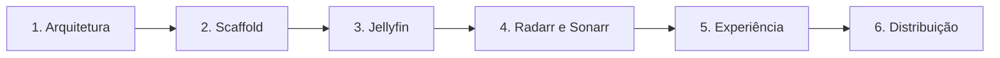

# Octopus Media Card — Plano de implementação

Status histórico: arquitetura e scaffold aprovados; Fase 3A Jellyfin e correções 3A.3 concluídas.
Status atual: Jellyfin recent/playing, imagens, strip, Playing Hero e Upcoming com Radarr/Sonarr
estão implementados no código local e cobertos por fixtures/testes existentes. Esta baseline ainda
aguarda gates locais e implantação/validação separada no HA-LAB; não é publicada nem released.

Status atual: Jellyfin recent/playing, imagens, strip, Playing Hero e Upcoming com Radarr/Sonarr
estão implementados no código local e cobertos por fixtures/testes existentes. Esta baseline ainda
aguarda gates locais e implantação/validação separada no HA-LAB; não é publicada nem released.

Documento de referência: [`architecture.md`](architecture.md).

## Fase 3C — protótipos visuais

- corrigir seleção contextual de arte de episódios sem alterar a arquitetura segura de imagens;
- centralizar tokens roxo/ciano e preparar os conceitos Cinematic Overlay, Gallery Clean e
  Octopus Glass;
- validar densidade 2 + parcial em 390 px e 4 + parcial em 800 px;
- manter os três conceitos somente no LAB até a escolha do usuário.

## 1. Objetivo de entrega

Entregar um release candidate publicável do Octopus Media Card como uma única custom integration HACS contendo:

- backend mínimo do Home Assistant para Jellyfin, Radarr e Sonarr;
- custom Lovelace card TypeScript/Lit;
- modos `recent`, `upcoming`, `playing` e `carousel`;
- layouts `auto`, `strip`, `grid`, `hero`, `compact`, `portrait` e `list`;
- editor visual;
- imagens autenticadas por referências opacas e caminhos assinados;
- testes backend, frontend, acessibilidade e regressão visual;
- documentação de instalação e troubleshooting;
- bundle reproduzível e verificado byte a byte.

Não haverá push, publicação, release ou uso do ambiente real sem autorização explícita.

## 2. Restrições de execução

### 2.1 Isolamento

Todo trabalho deve ocorrer sob:

```text
<repository-root>
```

É proibido:

- criar arquivos do Octopus Media Card na pasta pai;
- modificar, mover ou reutilizar `casa-voz-card.js`;
- reutilizar package.json, tsconfig, dependências, dist ou workflows do projeto anterior;
- incluir os dois projetos no mesmo commit;
- gravar URLs locais, user IDs reais ou chaves em código, fixtures, documentação ou commits.

### 2.2 Escopo

Somente recent, upcoming, playing, carousel, integração mínima e apresentação multimodal. Itens explicitamente fora do escopo em `architecture.md` não podem ser introduzidos como “preparação futura”.

### 2.3 Rede e dados

- testes não acessam serviços reais;
- clientes somente são implementados depois da validação de endpoints oficiais;
- fixtures são fictícias, pequenas e representativas;
- nenhuma chave real é necessária para lint, build ou teste;
- testes de timeout, TLS e rede usam mocks/fakes locais.

## 3. Estratégia de entregas

Cada fase termina com um gate verificável. Uma fase não é considerada concluída apenas porque os arquivos existem.



## 4. Fase 1 — arquitetura e contratos

### Entregáveis

- `docs/architecture.md`;
- `docs/implementation-plan.md`;
- posteriormente, antes de cada cliente, `docs/api-endpoints.md`.

### Decisões fechadas

- arquitetura híbrida mínima;
- ConfigEntry por stack, todos os serviços opcionais e ao menos um presente;
- credenciais somente no backend;
- coordenadores separados por frequência;
- snapshot versionado, patches por seção e detalhes sob demanda;
- datas UTC com `time_zone` do Home Assistant;
- política Radarr configurável;
- referências de imagem determinísticas;
- signed paths oficiais e endpoint restrito;
- mode separado de layout;
- ResizeObserver com histerese e IntersectionObserver para imagens;
- HACS como integração única;
- bundle canônico replicado e comparado byte a byte.

### Gate

- documentos revisados contra todas as decisões aprovadas;
- nenhuma ambiguidade sobre fronteira de segurança;
- decisões pendentes enumeradas, sem implementação especulativa;
- nenhum arquivo fora de `docs/` criado nesta fase.

## 5. Fase 2 — scaffold

Esta fase só começa após nova aprovação.

### 5.1 Estrutura proposta

```text
octopus-media-card/
├── custom_components/
│   └── octopus_media/
│       ├── api/
│       │   ├── __init__.py
│       │   ├── base.py
│       │   ├── jellyfin.py
│       │   ├── radarr.py
│       │   └── sonarr.py
│       ├── coordinators/
│       │   ├── __init__.py
│       │   ├── playing.py
│       │   ├── recent.py
│       │   └── upcoming.py
│       ├── frontend/
│       │   └── octopus-media-card.js
│       ├── translations/
│       │   ├── en.json
│       │   └── pt-BR.json
│       ├── __init__.py
│       ├── config_flow.py
│       ├── const.py
│       ├── diagnostics.py
│       ├── exceptions.py
│       ├── frontend.py
│       ├── http.py
│       ├── image_store.py
│       ├── manifest.json
│       ├── models.py
│       ├── normalize.py
│       ├── options_flow.py
│       ├── runtime_data.py
│       └── websocket.py
├── frontend/
│   ├── src/
│   │   ├── components/
│   │   ├── layouts/
│   │   ├── localization/
│   │   ├── api.ts
│   │   ├── config.ts
│   │   ├── image-resolver.ts
│   │   ├── models.ts
│   │   ├── styles.ts
│   │   ├── octopus-media-card.ts
│   │   └── octopus-media-editor.ts
│   ├── tests/
│   ├── playwright/
│   ├── package.json
│   ├── tsconfig.json
│   └── vite.config.ts
├── tests/components/octopus_media/
├── docs/
├── scripts/
├── dist/
├── screenshots/
├── .github/workflows/
├── .env.example
├── .gitignore
├── AGENTS.md
├── CHANGELOG.md
├── CONTRIBUTING.md
├── LICENSE
├── README.md
├── hacs.json
└── pyproject.toml
```

Não será criado `strings.json`: custom integrations devem fornecer os textos completos diretamente em `translations/en.json` e `translations/pt-BR.json`.

### 5.2 Python

Configurar:

- versão Python compatível com a versão mínima do Home Assistant escolhida;
- Ruff para lint e formatação;
- mypy ou pyright em modo estrito viável;
- pytest;
- pytest-homeassistant-custom-component;
- cobertura com limiar inicial definido após o primeiro conjunto de testes;
- imports e tipos compatíveis com APIs públicas do Home Assistant.

### 5.3 TypeScript

Configurar:

- TypeScript estrito;
- Lit como dependência explícita e empacotada;
- Vite em modo library, bundle único;
- ESLint;
- Prettier;
- Vitest e ambiente DOM;
- Playwright;
- browser targets alinhados aos navegadores suportados pelo Home Assistant;
- sem importação oportunista de Lit ou elementos privados internos do Home Assistant.

### 5.4 Fixtures e harness

Criar dados totalmente fictícios para:

- filmes recentes;
- episódios e agrupamento por série;
- títulos curtos e muito longos;
- calendários Radarr/Sonarr;
- datas digital, physical, cinema e fallback;
- uma, duas e três reproduções;
- nenhuma reprodução;
- serviço offline e dados stale;
- credencial rejeitada e timeout;
- imagem válida, ausente, inválida e grande demais.

O harness frontend simula `hass.connection` e o contrato do WebSocket, não uma instalação real.

### 5.5 Scripts de build

Fluxo planejado:

1. Vite gera `dist/octopus-media-card.js`;
2. script copia bytes para `custom_components/octopus_media/frontend/octopus-media-card.js`;
3. script de verificação calcula SHA-256 e tamanho;
4. build `--check` recompila em diretório temporário e compara com os dois artefatos versionados.

### Gate

- instalação de dependências reproduzível por lockfile;
- lint vazio nos arquivos iniciais;
- teste smoke Python e frontend passando;
- build mínimo produzindo bundles idênticos;
- nenhum cliente externo funcional ainda;
- `git status` contém somente arquivos do novo diretório.

## 6. Fase 3 — Jellyfin

Recorte executado: a Fase 3A entregou itens 6.1–6.5 e o caminho frontend `recent`/`playing`; a Fase 3B completou 6.6 com download autenticado, fallback, validação binária, cache LRU limitado, ETag, endpoint restrito e lazy signing oficial. Detalhes extensos permanecem fora deste recorte.

### 6.1 Gate de API

Antes do código:

- confirmar versões Jellyfin suportadas;
- documentar endpoints de autenticação/validação, usuários, recentes, sessões, metadados e imagens;
- registrar headers e campos consumidos;
- criar fixtures a partir da documentação, sem copiar dados reais;
- registrar comportamento de paginação, datas, ticks e image tags.

### 6.2 Config flow e runtime

- seleção dos serviços;
- passo Jellyfin opcional;
- validação de URL, autenticação, user ID e timeout;
- seleção de usuário quando a API suportada permitir;
- unique check da stack;
- reautenticação Jellyfin;
- options flow mínimo;
- setup/unload/reload da ConfigEntry;
- `RuntimeData` tipado.

### 6.3 Recent

- cliente assíncrono;
- normalização de Movie e Episode;
- fallback de imagem do episódio para série;
- ordenação por data decrescente;
- agrupamento opcional por série;
- contagem e episódio mais recente;
- `JellyfinRecentCoordinator`;
- seção recent e detalhes em cache.

### 6.4 Playing

- busca de sessões;
- filtro apenas playing/paused com mídia válida;
- aliases por DeviceId;
- posição, duração e progresso defensivos;
- múltiplas sessões;
- `JellyfinPlayingCoordinator`;
- ausência de controles remotos.

### 6.5 WebSocket

- `get_entries`;
- `get_snapshot`;
- `subscribe_snapshot`;
- `get_details`;
- `refresh` com rate limit;
- snapshot inicial e patches;
- unsubscribe correto;
- digests por seção.

### 6.6 Imagens

- segredo persistente por entrada;
- referências HMAC determinísticas;
- registry tipado;
- cache LRU, TTL e deduplicação em voo;
- `HomeAssistantView` autenticado;
- variantes fechadas;
- validação de tipo e tamanho;
- signed path solicitado pelo card;
- placeholders locais.

### 6.7 Frontend Jellyfin

- reducer do contrato;
- view models recent/playing;
- componentes básicos;
- layouts strip, hero, compact e list;
- avanço local de playing;
- lazy signing por IntersectionObserver;
- estados loading, empty, offline, stale e error.

### Gate

- recent e playing funcionam somente com snapshot normalizado;
- nenhuma credencial aparece em tráfego do card;
- referências sobrevivem a polling idêntico;
- várias instâncias do card não duplicam polling;
- unload não deixa tarefas ou inscrições;
- testes Jellyfin, imagem, WebSocket e quatro layouts passam.

## 7. Fase 4 — Radarr e Sonarr (registro histórico e implementação atual)

As seções abaixo preservam o plano e as decisões da fase. A implementação local posterior concluiu
o provider, a normalização, o coordinator, o merge Upcoming e a cobertura de testes descritos no
contrato; a validação no HA-LAB continua separada e ainda não ocorreu nesta baseline.

### 7.1 Gate de API

Para cada serviço:

- definir versões suportadas;
- confirmar endpoint de status/validação;
- confirmar calendário e parâmetros de janela;
- confirmar campos de monitoramento, arquivo, status e imagens;
- documentar paginação, timezones e datas;
- criar fixtures fictícias por variante.

### 7.2 Radarr

- cliente assíncrono;
- políticas digital, physical, cinema e earliest;
- fallback para primeira data futura;
- downloaded/monitored/status;
- referência de pôster.

### 7.3 Sonarr

- cliente assíncrono;
- série, temporada, episódio e título;
- air date em UTC;
- downloaded/monitored/status;
- pôster da série.

### 7.4 Upcoming composto

- resultados independentes por fonte;
- deduplicação;
- ordenação cronológica;
- `relative_day`, `days_remaining` e overdue;
- preservação stale por fonte;
- `partial=true` quando aplicável;
- digest semântico combinado.

### 7.5 Frontend upcoming

- view model;
- badges de origem/data/status;
- layouts strip, grid, hero, compact, portrait e list;
- detalhes sob demanda;
- datas traduzidas no fuso do snapshot.

### Gate

- upcoming funciona com somente Radarr, somente Sonarr ou ambos;
- falha de uma fonte mantém a outra;
- política Radarr tem testes para campo presente, ausente e fallback;
- datas não dependem do fuso do navegador;
- títulos longos permanecem presentes em todos os layouts prioritários.

## 8. Fase 5 — experiência multimodal

### 8.1 Layout strategies

Implementar interface comum:

```text
LayoutStrategy
  input: view model, dimensions, presentation config
  output: template Lit e navigation model
```

Layouts:

- auto;
- strip;
- grid;
- hero;
- compact;
- portrait;
- list.

Nenhuma strategy contém WebSocket, tradução de domínio ou busca de imagem.

### 8.2 Resize e estabilidade

- ResizeObserver único;
- medição de content box;
- rAF;
- breakpoints 280/450/700/1000;
- histerese 12 px;
- preservação por ref;
- nenhuma chamada backend em resize;
- teste de loops de observer;
- skeleton 2:3 para evitar layout shift.

### 8.3 Carousel

- sections filtradas por capabilities;
- uma única assinatura compartilhada;
- layout único no MVP;
- autoplay opcional;
- pausa após interação, hover, foco e page visibility;
- reduced motion força autoplay desligado;
- teclado, swipe e indicadores.

### 8.4 Editor visual

- get_entries e auto seleção;
- modos filtrados por capabilities;
- campos condicionais por layout;
- preview de auto em larguras simuladas;
- preservação de valores ocultos;
- eventos `config-changed`;
- registro em `window.customCards`.

### 8.5 Temas e localização

- auto, midnight, ocean, jellyfin e neutral;
- variáveis CSS públicas aprovadas;
- pt-BR e inglês;
- nenhuma string de interface dispersa nos componentes;
- pluralização e datas via camada de localização.

### 8.6 Acessibilidade

- navegação integral por teclado;
- foco visível;
- aria-labels;
- alt text;
- alvos de toque;
- contraste;
- reduced motion;
- conteúdo essencial independente de cor;
- auditoria automatizada e revisão manual.

### Gate

- matriz mode × layout válida;
- auto seleciona estratégias sem oscilar;
- item atual sobrevive a resize;
- strip não cria scroll vertical em 390×210;
- card funciona em celular vertical, 819×480 e desktop;
- editor não mostra credenciais;
- testes de acessibilidade e visuais passam.

## 9. Fase 6 — distribuição

### 9.1 Documentação pública

README:

- propósito e screenshots;
- arquitetura e serviços;
- instalação HACS como integração;
- instalação manual;
- config flow e options flow;
- registro do recurso Lovelace quando necessário;
- YAML mínimo e completo;
- modos, layouts, temas e editor;
- segurança de credenciais e signed paths;
- permissões;
- troubleshooting;
- desenvolvimento, testes, build e releases.

Documentos adicionais:

- security;
- configuration;
- troubleshooting;
- API endpoints;
- contributing;
- changelog;
- AGENTS.md.

### 9.2 HACS

- repositório categorizado como integration;
- exatamente um diretório em `custom_components`;
- todo runtime dentro de `custom_components/octopus_media`;
- `hacs.json` válido;
- `manifest.json` com version, codeowners, documentation e issue tracker;
- versão mínima de Home Assistant fixada;
- HACS Action em categoria integration;
- Hassfest;
- brand tratado antes de candidatura ao default store;
- release completa após autorização, nunca apenas tag.

O plano padrão não depende de `zip_release`: HACS instala o diretório da integração a partir da release/tag. Um zip pode ser produzido como artefato auxiliar, mas não vira requisito de instalação sem validação específica.

### 9.3 Resource Lovelace

- bundle servido via `async_register_static_paths`;
- usar auto-registro somente se houver API pública documentada na versão mínima;
- não manipular coleções privadas de Lovelace;
- fallback manual para storage/YAML com uma única URL do bundle;
- não copiar arquivos para `/config/www`;
- não instalar o frontend separadamente.

### 9.4 Release candidate

- versão inicial pretendida: `0.1.0-rc.1`;
- changelog completo;
- build limpo e reproduzível;
- bundles byte a byte idênticos;
- pacote testado em instalação Home Assistant descartável;
- nenhuma publicação sem autorização.

### Gate

- todos os jobs CI verdes;
- documentação reproduz instalação por uma terceira pessoa;
- scanner de segredos sem achados;
- artefato contém integração e bundle corretos;
- checklist de aceitação integral aprovado.

## 10. Plano de testes

### 10.1 Backend

Config flow:

- nenhum serviço;
- Jellyfin somente;
- Radarr somente;
- Sonarr somente;
- combinações;
- URL inválida;
- timeout;
- invalid auth;
- duplicação;
- reautenticação isolada;
- preservação de segredos internos.

Options flow:

- defaults;
- limites mínimos/máximos;
- intervalos;
- quantidades;
- agrupamento;
- aliases;
- idioma/data;
- quatro políticas Radarr.

Clientes:

- sucesso e normalização;
- status 401/403/404/429/5xx;
- timeout e cancelamento;
- conteúdo inválido;
- retry somente idempotente;
- SSL configurável;
- logs sem segredos.

Coordenadores:

- first refresh;
- polling distinto;
- um coordenador por entrada;
- múltiplos subscribers;
- falha parcial;
- stale;
- recuperação;
- digest idêntico;
- unload.

WebSocket:

- autenticação obrigatória;
- entrada desconhecida;
- capabilities;
- snapshot;
- patch;
- unsubscribe;
- details;
- refresh rate limit;
- schemas inválidos;
- nenhuma credencial serializada.

Imagens:

- ref determinística;
- mudança de revisão;
- ref desconhecida;
- entrada descarregada;
- assinatura ausente/expirada;
- variante inválida;
- tipo válido e inválido;
- limite de tamanho;
- redirect externo rejeitado;
- cache hit/miss/eviction;
- ETag/Last-Modified;
- cache negativo;
- deduplicação em voo;
- unload/reload.

Diagnostics:

- API keys, URLs, user IDs, segredo e referências internas redigidos.

### 10.2 Frontend unitário e componentes

- parsing de config e defaults;
- reducer de snapshot/patch;
- schema_version incompatível;
- view models dos quatro modos;
- filtro por capabilities;
- datas UTC no fuso do snapshot;
- progresso local;
- todos os layouts;
- seleção auto e histerese;
- ResizeObserver sem refetch;
- IntersectionObserver e assinatura lazy;
- renovação de signed path;
- zero/um/muitos itens;
- títulos e badges longos;
- estados loading/empty/offline/stale/error;
- editor e campos condicionais;
- temas e idiomas;
- keyboard/reduced motion/page visibility;
- cleanup de subscription, observers e timers.

### 10.3 Matriz visual Playwright

| Modo     | Layout   | Dimensão | Cenário        |
| -------- | -------- | -------: | -------------- |
| Recent   | Strip    |  390×210 | Três pôsteres  |
| Recent   | Strip    |  800×240 | Cinco pôsteres |
| Recent   | Grid     |  800×456 | Muitos itens   |
| Recent   | Compact  |  300×150 | Um item        |
| Recent   | Portrait |  390×844 | Duas colunas   |
| Upcoming | Strip    |  390×210 | Badges de data |
| Upcoming | Grid     | 1024×600 | Duas fontes    |
| Upcoming | Hero     |  800×240 | Destaque       |
| Upcoming | List     |  300×300 | Lista estreita |
| Playing  | Hero     |  800×240 | Uma sessão     |
| Playing  | Hero     |  800×240 | Título longo   |
| Playing  | List     |  300×300 | Três sessões   |
| Playing  | Compact  |  300×150 | Vazio          |
| Playing  | Strip    |  390×210 | Duas sessões   |
| Carousel | Auto     |  819×480 | Três seções    |
| Carousel | Auto     | 1280×720 | Desktop        |

Variações pairwise:

- 240×120, 390×120, 390×180, 360×640 e 600×1024;
- limites de breakpoint;
- missing image;
- offline e stale;
- pt-BR/en;
- tema claro/escuro;
- zoom e deviceScaleFactor 1.25;
- reduced motion;
- resize durante interação.

Snapshots somente mudam por revisão explícita e registrada no changelog do teste.

## 11. CI planejada

Jobs independentes:

1. Python lint/format/type check;
2. pytest backend com cobertura;
3. Hassfest;
4. HACS validation como integration;
5. ESLint e Prettier check;
6. TypeScript strict check;
7. Vitest;
8. Vite build;
9. verificação byte a byte e rebuild clean;
10. Playwright funcional;
11. Playwright visual em job dedicado;
12. secret scan;
13. montagem de artefato de release.

O job de bundle deve:

```text
build temporário
  == SHA-256 dist/octopus-media-card.js
  == SHA-256 custom_components/octopus_media/frontend/octopus-media-card.js
```

Nenhuma etapa pode baixar fixtures do ambiente do usuário.

## 12. Critérios de aceitação do MVP

### Instalação e configuração

- [ ] instala via HACS como uma única integração;
- [ ] pode ser instalado manualmente;
- [ ] serviços são configurados pela interface;
- [ ] ao menos um serviço é exigido;
- [ ] reautenticação funciona por serviço;
- [ ] card usa somente `entry_id` e configuração visual;
- [ ] nenhuma chave aparece no YAML ou chega ao navegador.

### Dados

- [x] recent funciona com Jellyfin;
- [ ] upcoming funciona com Radarr, Sonarr ou ambos;
- [x] playing mostra sessões playing/paused;
- [ ] carousel alterna entre múltiplas seções; a configuração é aceita e a primeira seção é renderizada;
- [x] snapshots são normalizados e versionados para recent/playing;
- [ ] detalhes extensos são carregados sob demanda;
- [ ] datas são UTC e hoje/amanhã usa o fuso do Home Assistant;
- [ ] política Radarr e fallback têm testes;
- [ ] falha de um serviço não apaga os demais;
- [x] dados Jellyfin preservados são marcados stale.

### Imagens e segurança

- [x] refs são opacas, determinísticas e estáveis;
- [x] endpoint fail-closed aceita somente refs registradas e variantes fechadas;
- [x] signed URLs são efêmeras e não persistidas;
- [x] somente imagens visíveis/próximas são assinadas;
- [x] nenhum proxy arbitrário é possível;
- [x] tipo, tamanho, redirect, timeout e cache são validados;
- [x] WebSockets e endpoints exigem autenticação;
- [x] diagnostics e logs não contêm segredos.

### Card e layouts

- [ ] quatro modos funcionam;
- [ ] sete layouts funcionam sobre o mesmo contrato;
- [x] auto usa largura real do card para recent/playing implementados;
- [x] histerese impede oscilação nos modos implementados;
- [x] resize não reinicia assinatura nem refaz requests de dados;
- [x] títulos longos permanecem presentes nos layouts prioritários;
- [x] strip não tem scroll vertical em 390×210;
- [x] 300×150, 390×150, 390×210, 800×240, limite 819 px, celular 390×844, zoom 125% e device scale factor 1,25 passam na matriz determinística;
- [ ] editor visual filtra capabilities e opções incompatíveis;
- [ ] pt-BR e inglês passam;
- [ ] teclado, foco, contraste e reduced motion passam.

### Qualidade e distribuição

- [ ] backend e frontend tests passam sem rede real;
- [ ] visual regression passa;
- [ ] build é reproduzível;
- [ ] bundles são byte a byte idênticos;
- [ ] HACS e Hassfest passam;
- [ ] README permite instalação sem ajuda;
- [ ] nenhum segredo está versionado;
- [ ] nenhum arquivo do projeto anterior está no diff;
- [ ] nenhuma release ou push ocorre sem autorização.

## 13. Checkpoints concluídos — Fases 3C.1 e 3C.2.2

- [x] promover a geometria D2 aprovada ao `layout: strip`;
- [x] usar o mesmo strip quando `layout: auto` o selecionar;
- [x] eliminar shelf, geometria D e custom element D2 duplicados;
- [x] preservar proporção 2:3, gaps 10/12 px e peek alvo de 22%;
- [x] tratar zero, um, dois e muitos itens sem duplicação, stretch ou `space-between`;
- [x] preservar caminhos assinados, cache, referências opacas e política de episódios;
- [x] adicionar preview fictício 390/800 ao editor;
- [x] documentar adaptações de opções YAML incompatíveis;
- [x] validar a instalação do strip somente no dashboard LAB;
- [x] obter aprovação visual do strip oficial antes da Fase 3C.2.

- [x] aprovar o Playing Hero V2.1 sem redesenhar sua geometria;
- [x] promover V2.1 a `mode: playing` + `layout: hero` sem gate experimental;
- [x] fazer `layout: auto` selecionar hero em 390×240 e larguras compatíveis;
- [x] remover o wrapper protótipo e preservar harness/fixtures úteis;
- [x] consolidar editor, estados, múltiplas sessões, progresso local e cleanup;
- [x] preservar o catálogo Jellyfin e a prioridade de nomes amigáveis;
- [x] congelar progresso em stale/offline e reconciliar snapshots live;
- [x] zerar os 24 débitos de lint registrados nos arquivos desta fase;
- [x] promover o refinamento de superfície única, removendo a cápsula externa e integrando o
      eyebrow `EM REPRODUÇÃO` sem interação;
- [x] restringir hover a `(hover: hover) and (pointer: fine)` e validar touch sem estado residual;
- [x] desenhar localmente a Fase 3C.2.3 com metadados opcionais vindos do mesmo snapshot de
      `Sessions`, sem nova chamada, polling ou fonte externa;
- [x] preservar o compacto abaixo de 560 px, mostrar uma linha editorial reduzida entre 560–699 px
      e liberar a linha completa/chips a partir de 700 px pela largura real do componente;
- [x] remover `Overview` do contrato `playing` e manter pôster + um único fluxo operacional;
- [x] validar a matriz local corrigida de 9 estados e ausências; promoção ao LAB continua pendente e exige
      autorização separada;
- [ ] publicar release; permanece proibido até autorização futura.

O próximo plano histórico era a Fase 4, limitada a validar contratos oficiais de Radarr/Sonarr,
implementar clientes/coordenador `upcoming`, normalizar datas conforme o fuso do Home Assistant e
exercitar falhas parciais. Esses itens já foram implementados no código local; a validação no
HA-LAB e a publicação permanecem pendentes.

## 14. Decisões ainda pendentes

Estas decisões não bloqueiam a documentação, mas devem ser fechadas antes do ponto indicado:

| Decisão                                           | Prazo                          | Critério                                                                                             |
| ------------------------------------------------- | ------------------------------ | ---------------------------------------------------------------------------------------------------- |
| Versão mínima do Home Assistant                   | antes do manifest              | APIs públicas necessárias, Python suportado e janela razoável                                        |
| Versão mínima do HACS                             | antes de hacs.json             | validação da categoria integration                                                                   |
| GitHub owner, URLs de docs/issues                 | antes do manifest              | repositório público definitivo                                                                       |
| Versões mínimas Jellyfin/Radarr/Sonarr            | antes de cada cliente          | documentação e fixtures verificadas                                                                  |
| Endpoints e campos exatos                         | antes de cada cliente          | `docs/api-endpoints.md` aprovado                                                                     |
| Capacidade/TTL finais do cache                    | antes do RC                    | perfil de memória e latência                                                                         |
| Disponibilidade de API pública para auto resource | antes do frontend registration | documentação oficial da versão mínima                                                                |
| Arte visual, ícone e screenshots finais           | fase 6                         | criar um polvo roxo original, com SVG próprio e licença explícita; até lá usar somente `mdi:octopus` |
| Versão final do primeiro RC                       | fase 6                         | changelog e semver                                                                                   |

Até essas decisões serem tomadas, o código não deve preencher valores fictícios ou usar internals como atalho.

## 15. Riscos e mitigação

| Risco                                  | Impacto                     | Mitigação                                                          |
| -------------------------------------- | --------------------------- | ------------------------------------------------------------------ |
| Variação de APIs externas              | dados incorretos ou falha   | gate de documentação, adapters isolados, fixtures por versão       |
| Auto-registro Lovelace sem API pública | instalação incompleta       | fallback manual documentado; não usar internals                    |
| Chaves vazarem em logs/diagnostics     | incidente de segurança      | exceções fechadas, redaction e testes de segredo                   |
| Signed path expirar                    | pôster quebrado             | lazy signing, prefetch próximo e uma renovação                     |
| Cache consumir memória                 | instabilidade do HA         | LRU, TTL, limite por entrada e profiling                           |
| Falha parcial apagar dados             | experiência enganosa        | estado por fonte, last-good e stale                                |
| Playing retransmitir arrays extensos   | tráfego e render excessivos | patches por seção e detalhes fora do snapshot                      |
| ResizeObserver oscilar                 | flicker e loops             | histerese, rAF, bucket estável e testes de limite                  |
| Sete layouts duplicarem lógica         | manutenção difícil          | view models e componentes compartilhados                           |
| Título desaparecer em altura fixa      | regressão principal         | line clamp, áreas flexíveis e matriz visual                        |
| Screenshots excessivamente frágeis     | CI ruidosa                  | cobertura pairwise, fontes determinísticas e atualização explícita |
| URLs locais entrarem em fixtures       | vazamento de ambiente       | placeholders, secret scan e revisão de diff                        |

## 16. Plano de commits locais

Nenhum commit será criado sem autorização. Quando autorizado, a separação proposta é:

1. `docs: define minimal hybrid architecture and implementation plan`
2. `chore: scaffold backend frontend and quality tooling`
3. `feat: add jellyfin recent and playing pipeline`
4. `feat: add radarr sonarr upcoming pipeline`
5. `feat: add multimodal card layouts and editor`
6. `chore: prepare hacs release candidate`

Cada commit deve conter apenas arquivos sob `octopus-media-card` e passar seus gates correspondentes.

## 17. Próximo passo proposto

Após aprovação explícita da etapa documental:

1. confirmar novamente o diretório ativo e o conteúdo existente;
2. criar apenas a estrutura da Fase 2;
3. configurar tooling e testes smoke;
4. criar fixtures fictícias iniciais;
5. produzir um bundle mínimo e verificar identidade byte a byte;
6. executar lint/test/build local;
7. apresentar resultados antes de iniciar qualquer cliente real.

O scaffold não deve conter implementações simuladas que pareçam dados de produção. Estados de demonstração existirão somente no harness e nas fixtures de teste.
